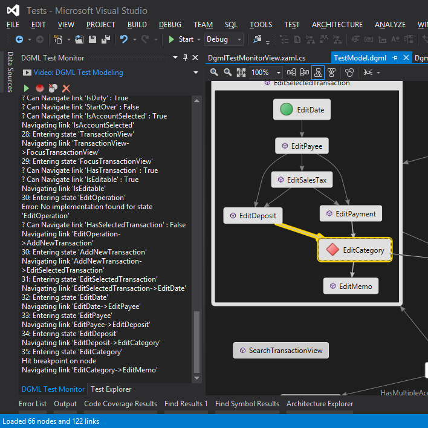

# DGML Test Modeling

See also [Demo Video](https://lovettsoftwarestorage.blob.core.windows.net/videos/DgmlTestModel.mp4)

The LovettSoftware.DgmlTestModeling.dll library contains the DgmlTestModel class which you can use
to execute a DGML test model. The execution state is writen to a named pipe so that the DGML Test
Monitor VSIX package can animate the progress during test execution. Included in the download is a
SampleTestModel.dgml which shows how to author a DGML test model.

### Example
To execute the model in an MSTest method do the following:

```csharp
[TestMethod]
public void RunModel()
{
    // This test executes a model of what and end user might want to do
    // The model is described in DGML
    try
    {               
        int seed = Environment.TickCount;
        var random = new Random(seed);
        TestContext.WriteLine("Model Seed = " + seed);
		var model = new DgmlTestModel(this, new TestLog(TestContext), random);
 
        string path = System.IO.Path.Combine(this.TestContext.TestDir, @"..\..\Tests\TestModel.dgml");
        model.Load(path);

        int delay = 0; // 1000 is handy for debugging.
        model.Run(new Predicate<DgmlTestModel>((m) => {
            return m.StatesExecuted > 500;
        }), delay);
   
     } catch {
         string temp = Path.GetTempPath() + "\\Screen.png";
         Win32.CaptureScreen(temp, System.Drawing.Imaging.ImageFormat.Png);
         TestContext.WriteLine("ScreenCapture: " + temp);
         throw;
     }
     finally
     {
         Terminate();
     }
}
``` 

The following picture shows the model executing inside VS using the DGML Test Monitor.


